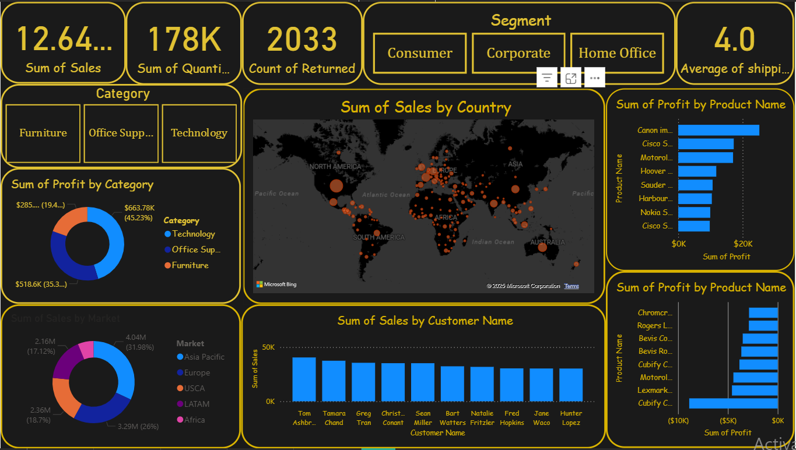
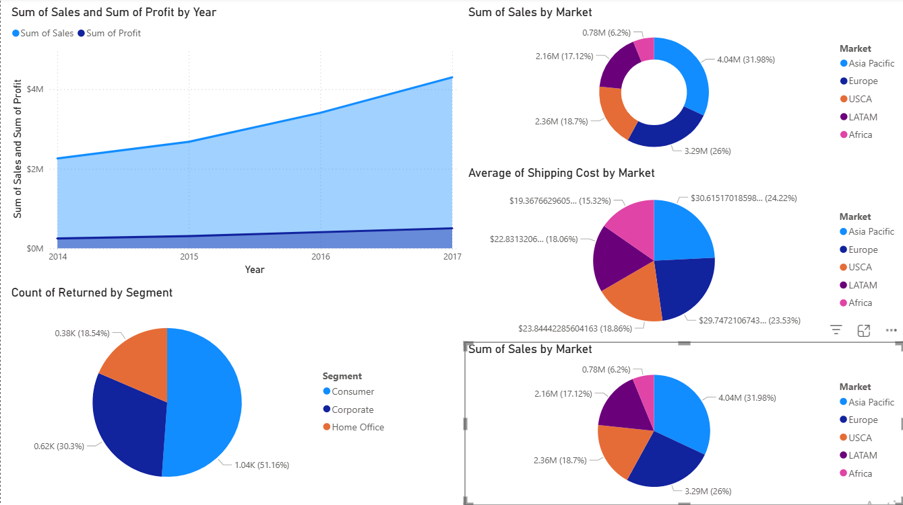
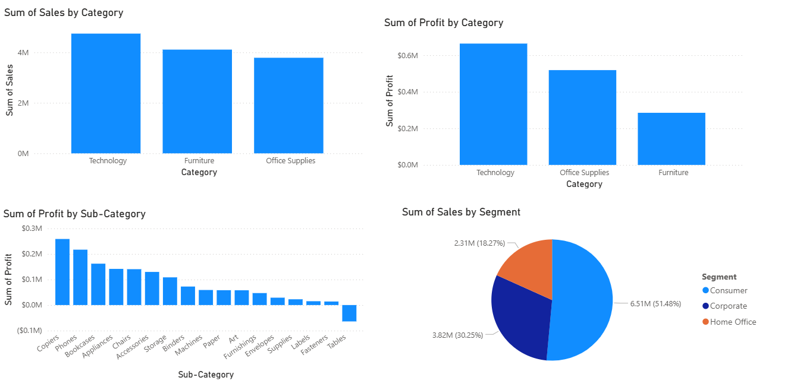
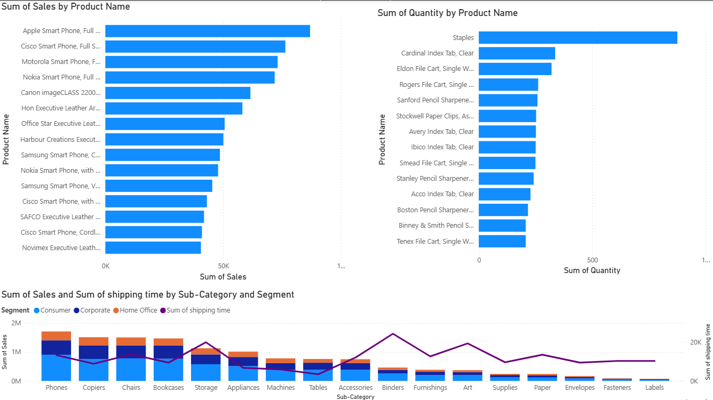

# 📊 Global Sales & Profit Dashboard

An interactive Power BI dashboard designed to analyze global sales performance, profits, and customer trends across categories, products, and markets.  

---

## 📝 Short Description / Purpose
The Global Sales & Profit Dashboard is built to provide businesses with a **comprehensive view of sales performance** across multiple regions, categories, and customer segments. It helps decision-makers quickly identify profitable products, analyze customer purchasing behavior, and optimize strategies for different global markets.

---

## ⚙️ Tech Stack
The dashboard was built using the following tools and technologies:

- 📊 **Power BI Desktop** – Main data visualization platform  
- 🔄 **Power Query** – Data transformation and preparation  
- 🧮 **DAX (Data Analysis Expressions)** – Custom measures and KPIs  
- 🗂 **Data Modeling** – Relationships across categories, segments, and customers  
- 📁 **File Format** – `.pbix` for development and `.png` for snapshots/previews  

---

## 📂 Data Source
**Source:** Sample Global Superstore dataset (sales, profit, customer, and region data).  

The dataset includes:  
- Sales and profit by **product category & product name**  
- Regional breakdown by **market & country**  
- Customer-level purchase details  
- Return counts & shipping KPIs  

---

## ✨ Features / Highlights  

### • Business Problem  
Businesses operating globally need to track **sales performance, product profitability, and customer behavior** across multiple regions to improve decision-making and strategy.  

### • Goal of the Dashboard  
- Provide a **360° view of global sales & profit trends**  
- Enable decision-makers to identify **top-performing products & customers**  
- Highlight **regional performance & growth opportunities**  
- Track **returns & shipping efficiency**  

### • Walkthrough of Key Visuals  
- **KPIs (Top Row)** → Total Sales, Quantity Sold, Count of Returns, Avg. Shipping Days  
- **Category Filters** → Drill down into **Furniture, Office Supplies, Technology**  
- **Profit by Category (Donut Chart)** → Compare profitability of major product categories  
- **Sales by Market (Donut Chart)** → Regional distribution across Asia Pacific, Europe, USCA, LATAM, and Africa  
- **Sales by Country (Map)** → Geographic visualization of global sales footprint  
- **Profit by Product Name (Bar Chart)** → Identify most profitable individual products  
- **Loss-Making Products (Bar Chart)** → Spot underperforming items with negative profit  
- **Sales by Customer (Bar Chart)** → Top customers driving revenue  

### • Business Impact & Insights  
- 📈 **Market Expansion** → Identify high-performing regions for future investments  
- 🎯 **Product Strategy** → Promote best-selling products and phase out low-profit items  
- 🤝 **Customer Targeting** → Recognize top customers for loyalty programs  
- 🚚 **Operational Efficiency** → Monitor shipping times & returns to reduce costs  

---

## 📷 Dashboard Preview
  

